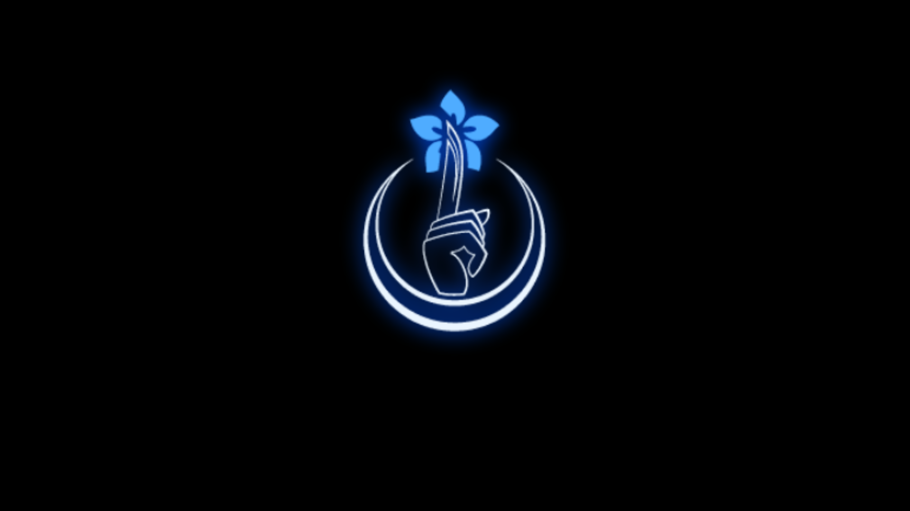

# WILL OF THE CITY :: THE INDEX

A Project-Moon-themed Hyprland rice — cyan CRT terminal aesthetic, the
flower-dagger emblem, the Perfect DOS VGA 437 pixel font, and a lock screen
with a scramble animation, audio, and the **WILL OF THE CITY** defense modal.



## What's in here

| Path | What it is |
|------|-----------|
| `install.sh` | Arch installer — deps, configs, font, wallpaper, hyprbars |
| `hypr/will-of-the-city.conf` | Borders + cyan glow + hyprbars titlebars + keybinds |
| `hypr/hyprlock.conf` | Lightweight lock (look + clock + password field) |
| `hypr/hypridle.conf` | Idle → lock / screen-off |
| `hypr/hyprpaper.conf` | Wallpaper daemon config |
| `quickshell/lock/lock.qml` | **Full lock** — scramble, audio, WILL OF THE CITY modal (real PAM) |
| `fastfetch/` | fastfetch config + the emblem ASCII logo (`index.txt`) |
| `assets/` | Pixel font, logo, profile, power/restart icons, sounds |
| `wallpaper/the-index.png` | The glowing emblem wallpaper |
| `preview/will-of-the-city-full.html` | Self-contained browser preview of the **whole** lock + desktop |

## Install

```bash
git clone https://github.com/HariUwU/index-OS.git
cd index-OS
chmod +x install.sh
./install.sh
```

Needs Arch + an AUR helper (`yay`/`paru`). Existing configs are backed up to
`~/.config/.index-backup-<timestamp>`.

## Two lock options

- **`hyprlock`** — reliable, ships with the look + password field. `hypridle`
  uses this by default.
- **`quickshell` lock (`lock.qml`)** — the full experience (scramble, sounds,
  the WILL OF THE CITY modal). Test it first from a TTY:
  ```bash
  quickshell -p ~/.config/quickshell/lock/lock.qml
  ```
  then point `hypridle`'s `lock_cmd` at it.

## Status

- ✅ Lock screen (hyprlock + quickshell), hypridle, hyprbars titlebars,
  themed borders/glow, fastfetch + emblem logo, wallpaper, pixel font
- ⚠️ Desktop **bar** + **atmosphere** (quickshell) — built (`quickshell/Bar.qml`,
  `Atmosphere.qml`, `shell.qml`), but **untested**: run `quickshell` inside a
  Hyprland session and expect to tweak an API name or two for your qs version.
  The atmosphere is a full-screen layer, so it needs a real GPU — it won't
  render under VirtualBox.

### Running the bar + atmosphere
The base config autostarts them (`exec-once = quickshell`). If you layered the
theme onto an existing config, add that line yourself — and **disable any bar
your distro already runs** (e.g. CachyOS's waybar) so you don't get two.

## Preview

Open `preview/will-of-the-city-full.html` in any browser (fullscreen).
Lock password: `index`. Fail 3× for the modal.

## Credits

Aesthetic inspired by Project Moon / Limbus Company. Emblem + assets by the
repo owner. Perfect DOS VGA 437 font by Zeh Fernando.
