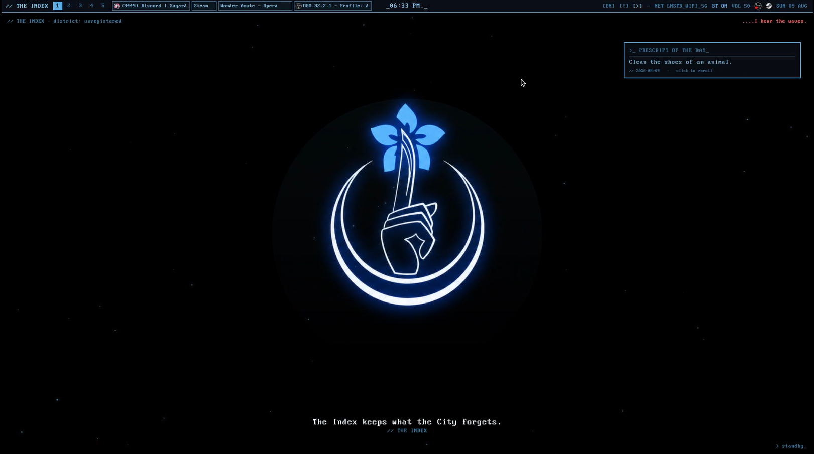

<div align="center">



# WILL OF THE CITY :: THE INDEX

**A cyan CRT desktop for Linux.**


</div>

---

## What is this

A complete desktop environment, themed after *The House of Spiders: The Index*.

Built on **labwc** (window manager) and **quickshell** (bar, menus, lock).

> Install it on a fresh system with **no desktop environment** — this *is* the
> desktop. It will replace what you have.

---

## Install

You need an Arch-based system (CachyOS, EndeavourOS, Arch) with no desktop
environment installed.

```bash
sudo pacman -S --needed git base-devel

git clone https://aur.archlinux.org/yay.git ~/yay && (cd ~/yay && makepkg -si)

git clone https://github.com/HariUwU/index-OS.git ~/index-OS
cd ~/index-OS && ./install.sh

reboot
```

That’s it. The installer handles everything and prints a checklist when it’s
done — every line should be green. Reboot and your machine goes straight to the
INDEX lock screen.

Safe to re-run `./install.sh` any time.

<details>
<summary>Other distros (Debian, Ubuntu, Fedora, openSUSE)</summary>

<br>

The installer detects `apt` / `dnf` / `zypper` and installs the right packages,
but this is **experimental** — quickshell is only packaged on Arch, so it gets
compiled from source. That’s slow and the most likely thing to fail.

</details>

---

## What you get

- **Bracket titlebars** on every window, forced server-side so apps use one bar
- **The bar** — start menu with search, workspaces, taskbar, media, network,
  bluetooth, battery, volume, keyboard layout, tray, centred clock
- **Panels** — wifi picker, bluetooth pairing, notification history, quick settings
- **The lock** — boot intro video, scramble auth, WILL OF THE CITY fixer modal
- **Prescript of the day** — a desktop widget that scrambles into a new
  instruction each morning
- **Sound and animation** throughout, with an ON/OFF toggle
- **Silent boot** — autologin straight into the lock, no text, no flash

---

## Make it yours

Drop a file in `assets/`, re-run `./install.sh`.

| File | What it changes |
|------|-----------------|
| `assets/intro.mp4` | boot intro video |
| `assets/sounds/bg.mp3` | lock screen music |
| `assets/DefaultProfile.jpg` | your profile picture |

---

## Licence

Code is **GPL-3.0**. Original artwork, sounds and the extended pixel fonts are
also available under **CC BY-SA 4.0**.

Some bundled files belong to other people and are not relicensed here — see
[ATTRIBUTION.md](ATTRIBUTION.md).

*Limbus Company* and *The House of Spiders: The Index* are the property of
Project Moon. This is an unaffiliated fan project.

---

<div align="center">

`#5DADE2` · `#85C5E8` · `#3A7CA5` · `#FF6B6B` · `#5DE285` · `#05080d`

*"The Index keeps what the City forgets."*

`>_ THE INDEX_`

</div>
